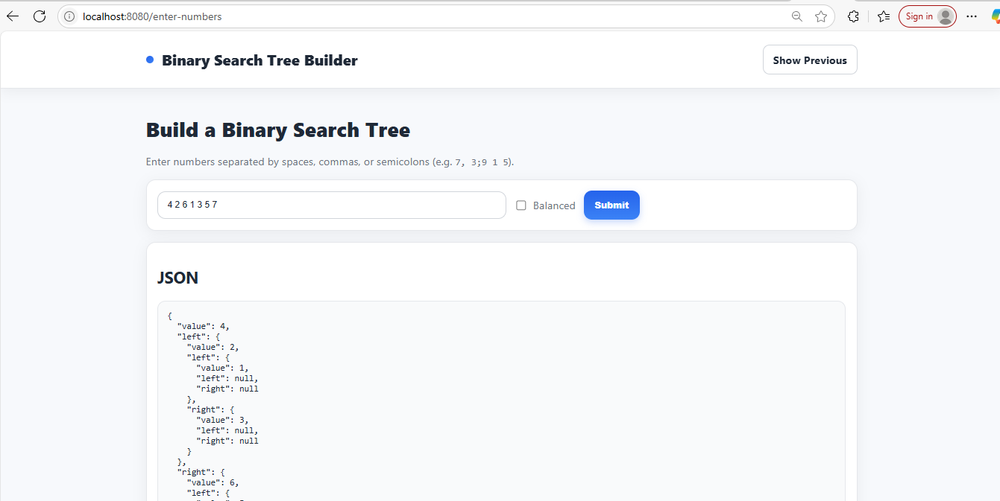
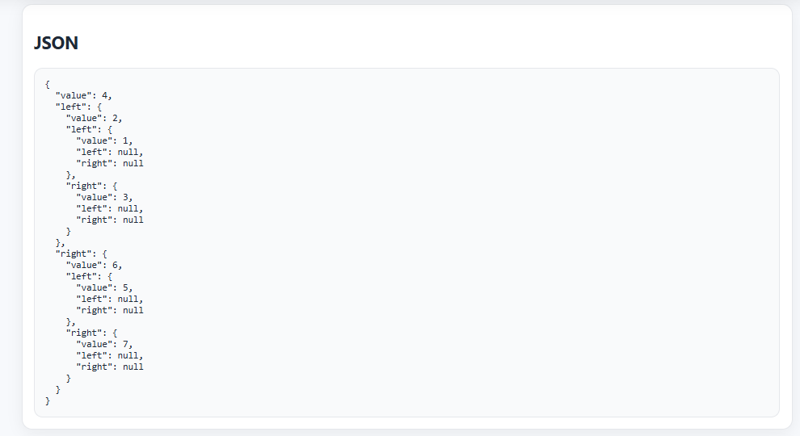
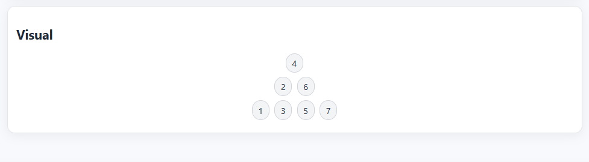
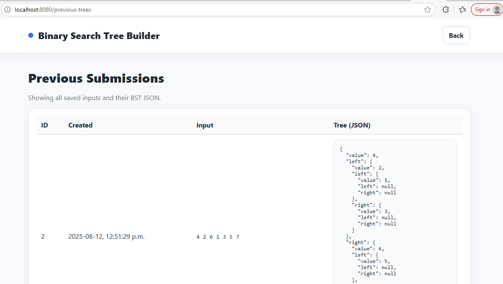
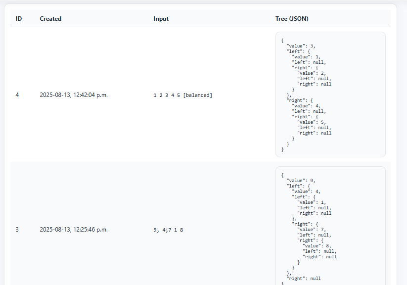
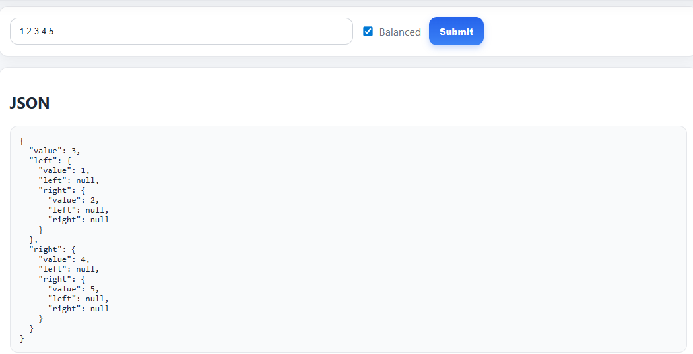
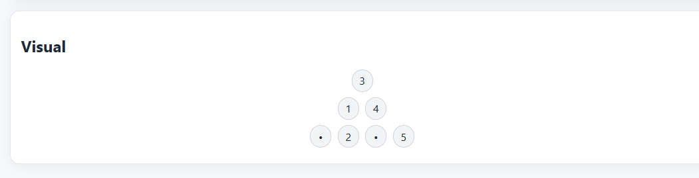

# Binary Search Tree (BST) Builder

A Spring Boot web application that allows users to **build**, **visualize**, and **store** Binary Search Trees (BSTs).
The app provides an interactive frontend (HTML + CSS + JavaScript) and a REST backend for tree creation, retrieval, and storage in a database.
Supports **balanced** and **unbalanced** BST generation.

---

## Features

- **User Input Interface** (`/enter-numbers` – index page):
    - Enter a sequence of numbers separated by spaces, commas, or semicolons.
    - Option to create a **balanced BST**.
    - Submit form to get JSON and a **visual representation** of the tree.
    - View **previous submissions** stored in the database.

- **Processing Route** (`/process-numbers`):
    - Builds a BST from the provided numbers.
    - Optionally balances the BST.
    - Returns the tree structure in JSON format.
    - Saves both the input numbers and the tree to the database.

- **Previous Trees** (`/previous-trees`):
    - Lists all saved BSTs with:
        - Submission time
        - Input numbers
        - Generated JSON

- **Bonus Feature**:
    - Balanced BST generation using sorted unique values.

---

## Technologies Used

- **Java 21** (or your JDK version)
- **Spring Boot** (Web + Data JPA)
- **MySQL Database** 
- **Basic HTML frontend** 
- **CSS for styling** 
- **JavaScript (Vanilla)** for visualization
- **Mockito** + **JUnit 5** for testing

---

## Project Structure

```
src/
 ├── main/
 │   ├── java/com/keyin/BinarySearchTree_app
 │   │   ├── controller/      # Handles HTTP requests
 │   │   ├── dto/             # Data Transfer Objects (TreeNodeDTO)
 │   │   ├── entity/          # TreeRecord
 │   │   ├── repository/      # TreeRecordRepository
 │   │   ├── service/         # BST logic & persistence
 │   ├── resources/
 │       ├── templates/       
 │       ├── static/          # CSS + JS files + index.html + previous.html
 │       ├── application.properties
 └── test/
     ├── java/com/keyin/BinarySearchTree_app/service/BstServiceTest.java
```

---

## How to Run

1. **Clone the repository**
   ```bash
   git clone https://github.com/WalidJer/BinarySearchTree-app.git
   cd bst-builder
   ```

2. **Build and run the application**
   ```bash
   mvn spring-boot:run
   ```

3. **Open the app in your browser**
   Go to [http://localhost:8080](http://localhost:8080)

---

##  API Endpoints

| Method | Endpoint                   | Description |
|--------|----------------------------|-------------|
| GET    | `/` or `/enter-numbers`     | Displays the main page with input form |
| POST   | `/process-numbers`          | Processes numbers from form submission and builds a BST |
| POST   | `/process-numbers-json`     | Accepts JSON input and builds BST |
| GET    | `/api/previous`             | Returns a list of previous BST submissions in JSON format |
| GET    | `/previous-trees`           | Displays previous BSTs in a user-friendly HTML table |

---

## Unit Testing

This project uses **JUnit 5** and **Mockito** for unit testing.

### Test Coverage:
- **`parseNumbers`**
    - Accepts numbers separated by spaces, commas, or semicolons.
    - Handles empty strings.
    - Throws `NumberFormatException` for invalid inputs.
- **`buildTreeDto`**
    - Ensures correct insertion order.
    - Handles duplicates correctly.
- **`buildBalancedTreeDto`**
    - Builds a balanced BST with sorted distinct values.
- **`buildAndSave`**
    - Persists both input and tree structure to the database.

```bash
   @Test
    void buildBalancedTreeDto_usesSortedDistinctAndCentersRoot() {
        // duplicates removed by distinct(), expect middle(1,2,3,4,5)=3
        TreeNodeDTO t = svc.buildBalancedTreeDto(List.of(1,2,3,3,4,5,5));
        assertEquals(3, t.value);
        assertEquals(1, t.left.value);
        assertEquals(2, t.left.right.value);   // 2 > 1 -> right child
        assertEquals(4, t.right.value);
        assertEquals(5, t.right.right.value);
    }
```


---

## Screenshots

### 1. Home Page – Enter Numbers


### 2. JSON Output & Tree Visualization



### 3. Previous Submissions Page



### 4. Balanced Binary Search Tree




